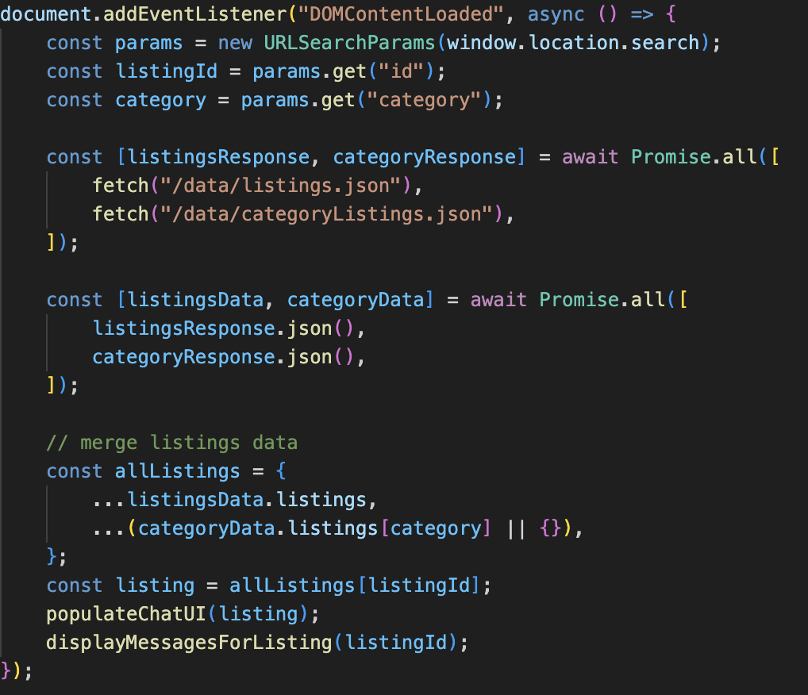
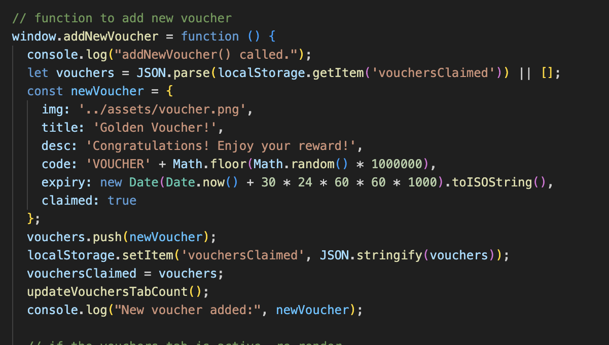

# FED_ASSG2_S10269128F_S10268119C  
# **MokeSell: A Gamified and Interactive Consumer-to-Consumer Marketplace**  
https://qixuaann.github.io/FED_ASSG2_S10269128F_S10268119C/

---

## **Project Overview**  
MokeSell is an innovative online marketplace designed for users to buy and sell both new and second-hand items. The platform enables seamless account creation, item listing, and secure transactions. To make the user experience more engaging, we have introduced new features such as gamification and treasure hunts. These additions enhance user interaction, foster community engagement, and increase loyalty.  

While retaining core functionalities like account management and transaction handling, MokeSell offers a unique and fun shopping experience that keeps users coming back. We have chosen a neutral color scheme to create a calming and user-friendly environment, ensuring effortless navigation and an overall enhanced user experience.  

---

## **Design Process**  
MokeSell is designed for individuals looking for an interactive, user-friendly marketplace that encourages engagement through gamification. Our target users include:  

- **Sellers:** Individuals selling new or second-hand items and engaging with an active marketplace.  
- **Buyers:** Consumers seeking affordable, unique, or second-hand goods through an intuitive and engaging platform.  
- **Engaged Users:** People who enjoy interactive elements, gamification, and a sense of competition, enhancing user retention and satisfaction.  

### **User Stories**  
- As a buyer, I want to search for specific items so that I can quickly find what I need.  
- As a seller, I want to list my items with photos and descriptions so that I can attract potential buyers.  
- As a user, I want to participate in treasure hunts so that I can earn rewards and discounts.  
- As a buyer, I want to chat with sellers so that I can negotiate offers and finalize transactions.  
- As a user, I want a review system so that I can make informed decisions based on previous buyer experiences.  

### **Design Assets**  
Wireframes and mockups are included here:  
[Figma Design Link](https://www.figma.com/design/a8uwqeScDyTBGEA53oV2mP/MokeSell---P05--Joyce-%26-Qi-Xuan?node-id=0-1&t=rSiWX1jJ6RZRT3Q7-1)  

---

## **Features**  
### 1. **Gamification**  
- **Treasure Hunt**  
  - Specially tagged items, such as "Golden Find," can be discovered by browsing the marketplace.  
  - Each category (e.g., electronics, furniture) includes hidden treasures that offer rewards such as discounts, loyalty points, or badges.  
  - The hidden treasure appears as a ‘game console’ icon. Clicking on the icon grants a reward.  
  - Treasure hunts incentivize users to explore the platform frequently, creating an element of surprise and excitement.  

### 2. **Account Management**  
- **Account Creation & Login:** Simple and secure account registration and login process.  
- **Profile Management:** Users can update their personal information and settings dynamically.  

### 3. **Listing Management**  
- **Create Listings:** Sellers can list items by uploading photos, selecting categories, and providing detailed descriptions.  
- **Active Listings Limit:** Sellers can manage up to 30 active listings for free.  

### 4. **Browsing and Search**  
- **Category Browsing:** Browse items by categories or sub-categories for an organized and efficient shopping experience.  

### 5. **Transaction Management**  
- **Chat Feature:** Integrated chat system for direct communication between buyers and sellers to discuss transaction details.  
- **Chat List:** Buyers can scroll through and filter the chat page for every listing on the marketplace.  

### **Features Left to Implement**  
- **Auction Mode:** Allows sellers to list items with bidding functionality.  
- **AI-Powered Recommendations:** Suggests relevant items based on user behavior.  
- **Referral Program:** Users can invite friends and earn rewards.  

---

## **Technologies Used**  
- **HTML, CSS, JavaScript:** Core technologies for structuring and styling the platform.  
- **Firebase Realtime Database:** Store product listings (category/popular) and chat history.  
- **RestDB:** Secure user authentication and account management.  
- **LocalStorage:** Store data in user's browser.  

---

## **Assistive AI Usage**  
- **ChatGPT** was used to generate the initial project structure, improve code snippets, and troubleshoot bugs.  

This screenshot shows the merging of data from 2 json files 

This screenshot shows the function to increment vouchers for gamification

---

## **Testing**  
### **Manual Testing**  
- **Contact Form:**  
  - Attempted submission of an empty form verified an error message appears.  
  - Tested form with an invalid email address, and a relevant error message was displayed.  
  - Successfully submitted a valid form and confirmed a success message.  

- **Browser Compatibility:**  
  - Tested on Chrome, Firefox, Safari, and Edge for responsiveness.  
  - Verified mobile responsiveness on various screen sizes.  

- **Bug Fixes & Observations:**  
  - Identified an issue where expired listings remained visible; fix in progress.  
  - Noticed minor alignment issues on smaller screens; adjustments made.  

---

## **Credits**  
### **Media**  
- All images used for listings were sourced from [Unsplash](https://unsplash.com/), [Pinterest](https://www.pinterest.com/), [Canva](https://www.canva.com/), and [eBay](https://www.ebay.com/).  

### **Acknowledgements**  
- Inspiration for the gamification mechanics was drawn from various e-commerce platforms.  

---